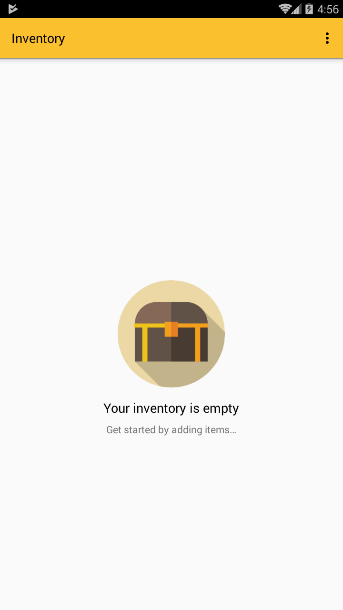
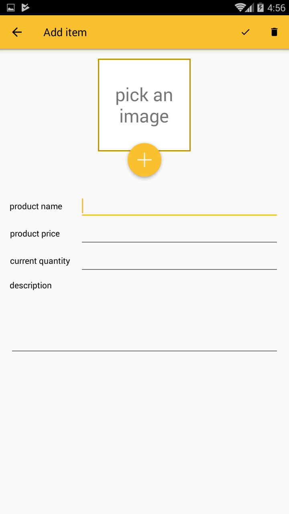
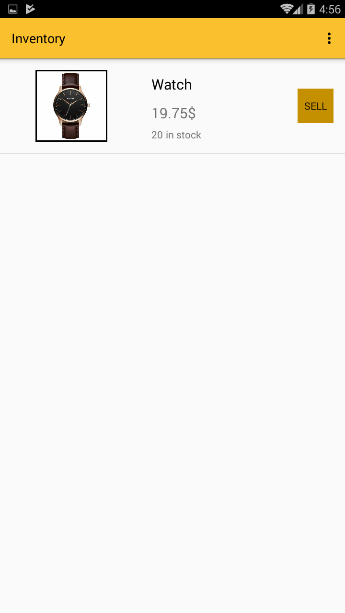
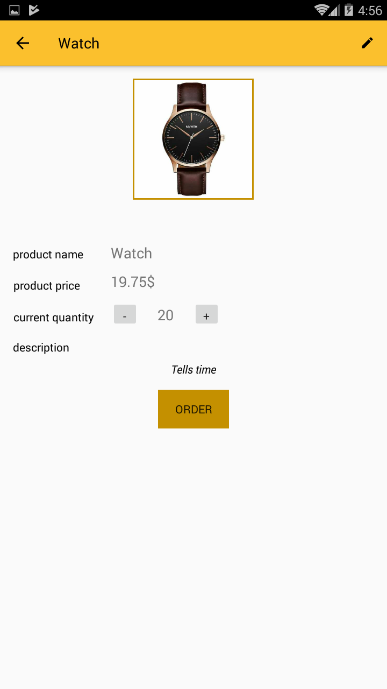

# Inventory app
Final project in udacity's android course on data storage.
This app can be useful for someone who runs a store and wants to keep track of all his products.
## Screenshots
|   |   |   |   |
| - | - | - | - |
|  |  |  |  |
## Functionality
You can add items to your inventory, specify a name, price, quantity and an optional description. 
After entering the information, you can save the item, and the data will be stored in a database. 
The catalog view is a list view of all the items in the database. 
Clicking on a list item opens up a detail view which contains detailed information about the item, and an order button. 
Clicking on the order button opens up Amazon website in the navigator, and searches the website for the name of the item. 
The detail view also contains a menu item which allows editing the item.
## Icons License

Icons made by <a href="http://www.freepik.com" title="Freepik">Freepik</a> from <a href="https://www.flaticon.com/" title="Flaticon">www.flaticon.com</a> is licensed by <a href="http://creativecommons.org/licenses/by/3.0/" title="Creative Commons BY 3.0" target="_blank">CC 3.0 BY</a>

